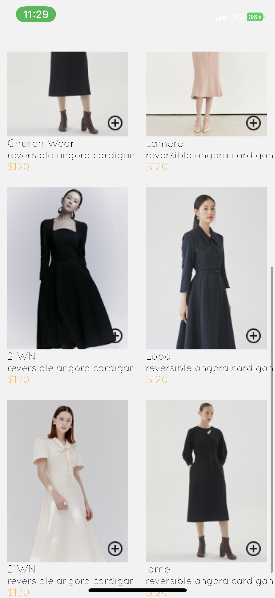
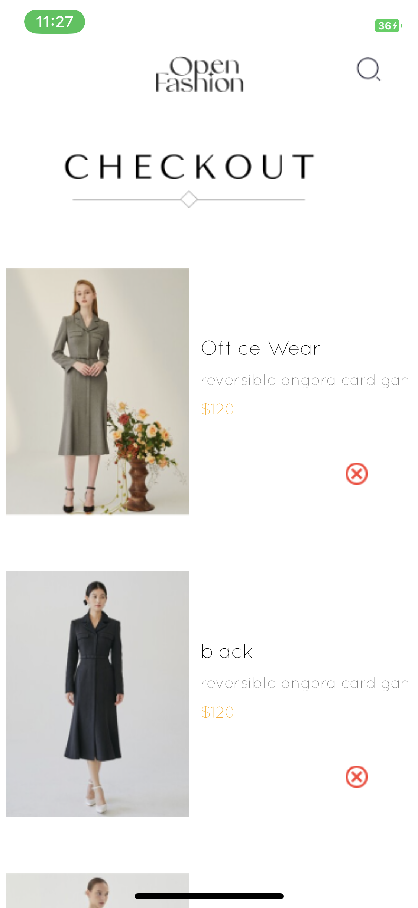
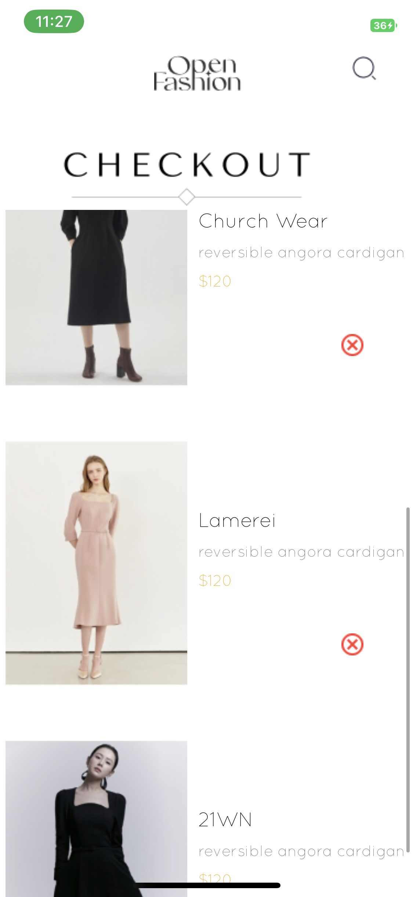

# rn-assignment6-11105718

## ID:11105718

## HOMESCREEN
This component consist of a separate functional component with details such as the picture,name of product,description and price.
This component also contains individual buttons that add the selected item to the cartScreen.

## CHECKOUTSCREEN
This component contains the remove item buttons and all items added to be checked out.
Each component is retrieved from the local storage and displayed on this screen.

## MODE OF STORAGE
AsyncStorage was used to store the individual item components.

